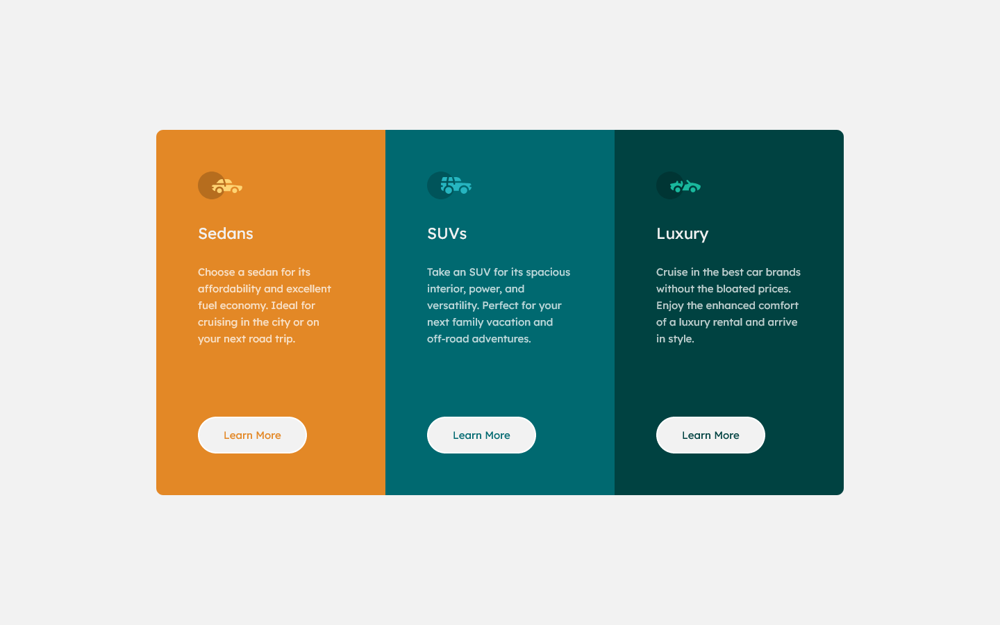

# Frontend Mentor - 3-column preview card component solution

This is a solution to the [3-column preview card component challenge on Frontend Mentor](https://www.frontendmentor.io/challenges/3column-preview-card-component-pH92eAR2-). Frontend Mentor challenges help you improve your coding skills by building realistic projects. 

## Table of contents

- [Overview](#overview)
  - [The challenge](#the-challenge)
  - [Screenshot](#screenshot)
  - [Links](#links)
- [My process](#my-process)
  - [Built with](#built-with)
  - [What I learned](#what-i-learned)
- [Author](#author)

## Overview

### The challenge

Users should be able to:

- View the optimal layout depending on their device's screen size
- See hover states for interactive elements

### Screenshot




### Links

- [Solution URL](https://github.com/dellenar/3-column-preview-card-component)
- [Live Site URL](https://dellenar.github.io/3-column-preview-card-component/)

## My process

### Built with

- Semantic HTML5 markup
- CSS custom properties
- Flexbox

### What I learned

I'm trying to get used to :root using with var() function to make my code more efficient.

```css
:root{
    --clr-bright-orange:hsl(31, 77%, 52%);
    --clr-dark-cyan:hsl(184, 100%, 22%);
    --clr-very-dark-cyan:hsl(179, 100%, 13%);
    --clr-transparent-white:hsla(0, 0%, 100%, 0.75);
    --clr-very-light-grey:hsl(0, 0%, 95%);
    --f-family-head: 'Big Shoulders Display', cursive;
    --f-family-content: 'Lexend Deca', sans-serif;
    --fs-15:15px;
    --fw-400:400;
    --fw-700:700;
}
```
## Author

- Github - [Dellenar](https://github.com/dellenar)
- Frontend Mentor - [@dellenar](https://www.frontendmentor.io/profile/dellenar)
