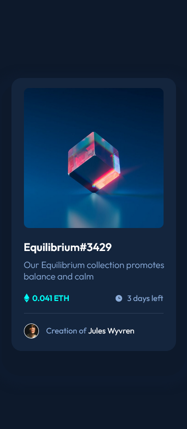

# Frontend Mentor - NFT preview card component solution

This is a solution to the [NFT preview card component challenge on Frontend Mentor](https://www.frontendmentor.io/challenges/nft-preview-card-component-SbdUL_w0U). Frontend Mentor challenges help you improve your coding skills by building realistic projects. 

## Table of contents

- [Overview](#overview)
  - [The challenge](#the-challenge)
  - [Screenshot](#screenshot)
  - [Links](#links)
- [My process](#my-process)
  - [Built with](#built-with)
  - [What I learned](#what-i-learned)
- [Author](#author)


## Overview

### The challenge

Users should be able to:

- View the optimal layout depending on their device's screen size
- See hover states for interactive elements

### Screenshot





### Links

- Solution URL: [Solution URL](https://github.com/dellenar/nft-preview-card-compenent)
- Live Site URL: [Live Site URL](https://your-live-site-url.com)

## My process
  Since I started to FrontendMentor Challenges i have much more confidence on building smooth structure. Also improved on using modern html semantics and modern css methods that i've learned
### Built with
- Semantic HTML5 markup
- CSS custom properties
- CSS Positioning
- CSS Flexbox

### What I learned

It was bit hard to understand to make image hover effect but at the end i make combine my style and some form search and make it through also understand the structure very well

To see how you can add code snippets, see below:

```html
<div class="nft">
  <div class=" nft-container">
    
    <div class="overlay"></div>
    <div class="overlay-logo">
        
    </div>
  </div>
</div>
```
```css
.nft-container{
    position: relative;
    margin: 20px 25px;
}

.nft img{
    max-width: 280px;
    border-radius: 10px;
}

.overlay{
    position: absolute;
    top: 0;
    left: 0;
    opacity: 0;
    padding: 140px 140px;
    background: hsl(178, 100%, 50%);
    border-radius: 10px;
}


.overlay-logo{
    position: absolute;
    top: 43%;
    left: 43%;
    opacity: 0;
}

.overlay-logo img{
   max-width: 40px;
}

.nft:hover .overlay{
    opacity: 0.5;
    cursor: pointer;
}

.nft:hover .overlay-logo{
    opacity: 1;
    cursor: pointer;
}

```

## Author

- Github - [Dellenar](https://github.com/dellenar)
- Frontend Mentor - [@dellenar](https://www.frontendmentor.io/profile/dellenar)
