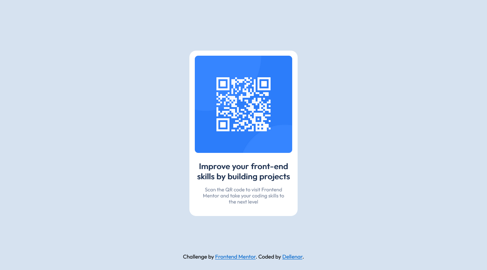

# Frontend Mentor - QR code component solution

This is a solution to the [QR code component challenge on Frontend Mentor](https://www.frontendmentor.io/challenges/qr-code-component-iux_sIO_H). Frontend Mentor challenges help you improve your coding skills by building realistic projects. 

## Table of contents

- [Overview](#overview)
  - [Screenshot](#screenshot)
  - [Links](#links)
  - [Built with](#built-with)
  - [What I learned](#what-i-learned)
  - [Continued development](#continued-development)
  - [Author](#author)

## Overview
The challenge

Challenge is to build out this QR code component and get it looking as close to the design as possible.

### Screenshot

### Links

- Solution URL: [Solution](https://github.com/dellenar/qr-code-compenent)
- Live Site URL: [Live Site URL]()

### Built with

- Semantic HTML5 markup
- CSS custom properties
- Flexbox
-

### What I learned

- Center with flexbox method
- Card structure

### Continued development

I want to get more comfortable with modern html sctructure and semantics to make my styles more smooth and readable 

## Author
- Github - [Dellenar](https://github.com/dellenar)
- Frontend Mentor - [@dellenar](https://www.frontendmentor.io/profile/dellenar)
